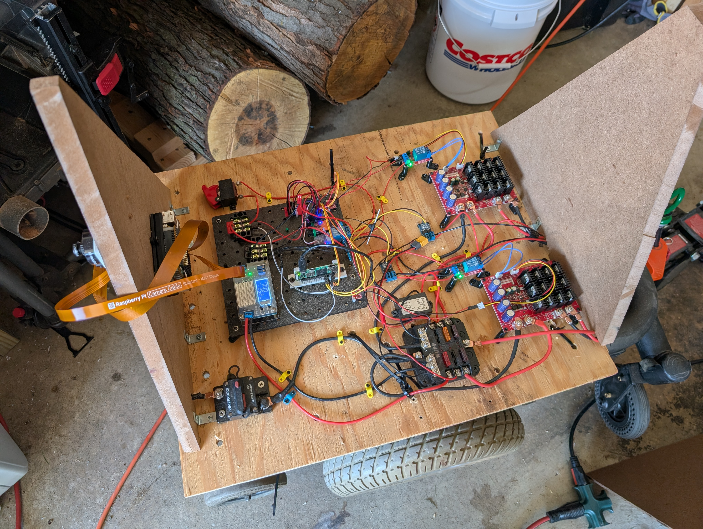
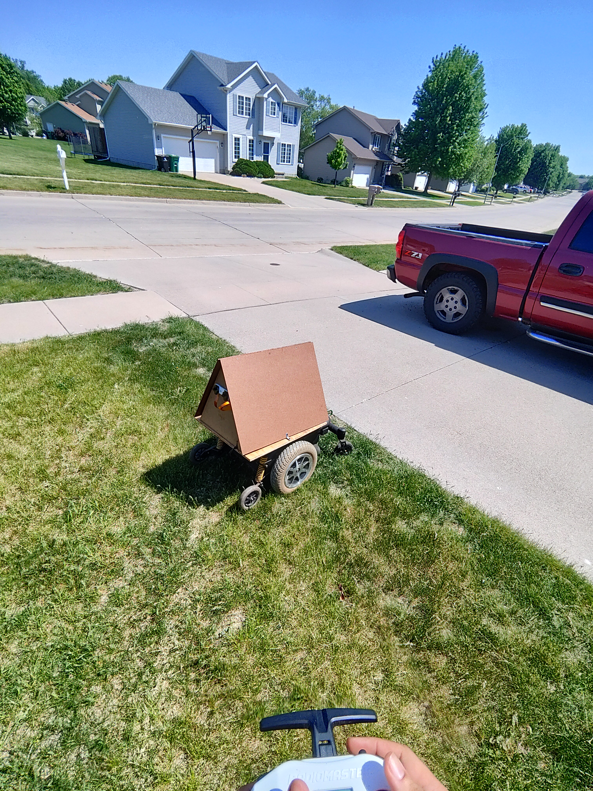

# roboRob

Robotics stack for a dual-Pi setup:

## RoboWheels in action

<table>
  <tr>
    <td width="50%">
      
    </td>
    <td width="50%">
      
    </td>
  </tr>
  <tr>
    <td align="center"><strong>Electronics bay</strong></td>
    <td align="center"><strong>Outdoor drive test</strong></td>
  </tr>
</table>

<video src="assets/vid-20260515-151634-f8.mp4" controls width="100%" title="RoboWheels remote-control drive demo"></video>

[Watch the remote-control drive demo](assets/vid-20260515-151634-f8.mp4)

## Project layout

| Directory | Hardware | Role |
|-----------|----------|------|
| [robowheels/](robowheels/) | Raspberry Pi Zero 2 W | Motion: CRSF radio, motors, brakes, USB gadget AI serial |
| [robobrain/](robobrain/) | Raspberry Pi 5 + AI HAT+ | Perception and AI movement commands to robowheels |

## Clone

```bash
git clone https://github.com/JamesRodgers-git/roboRob.git
cd roboRob
```

